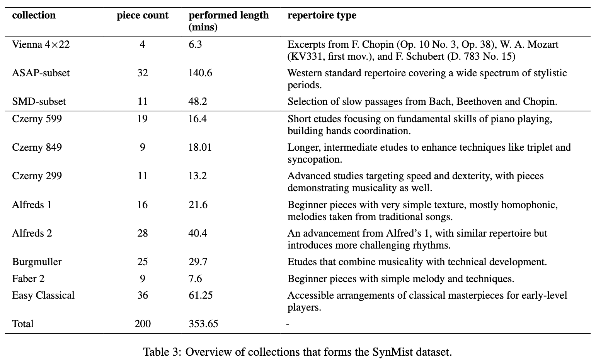

# Simulating Piano Performance Mistakes for Music Learning

This is the repository of SynMist, containing the synthesized mistake dataset as well as python scripts that generates the mistakes in a taxonomical way. ```mistake_by_type.py``` and ```lowlvl.py``` contains functions regarding to the mid-level mistake scheduler and low-level deviation functions. ```region_classifier.py``` contains the simple texture \ technique region identifier. 


### Generating mistakes 
```
python mistake_by_type.py <input_midi_folder> <output_midi_folder> <run_id>
```
This processes all midi performance files in <input_midi_folder>, applies mistakes to them, and saves the files in <run_id>/<output_midi_folder>


## Data
The detailed analysis and annoation of individual mistakes from both datasets can be found [here](https://docs.google.com/spreadsheets/d/1QzKa0k5GlVt60PsUCvdDk8LiBAyWKOlPuEQl1Yf1ujA/edit#gid=0). 

### Burgmuller Dataset
For accessing the burgmuller dataset, please refering to the original paper [project page](https://sites.google.com/view/ismir2023-conspicuous-error) and find the download link. 

### Expert Novice Dataset

For the augmented version of expert-novice dataset (containing transcribed MIDIs and error-annotation), please refer to the [repository](https://github.com/anusfoil/EN-augmented-data). 


## Teacher's feedback

For interviews with piano teachers, we have put the evaluated samples into an [online questionnaire](https://golisten.ucd.ie/task/acr-test/65e4d319552c347eae0081dd). Their anonymized comments and rating are shown [here](https://drive.google.com/file/d/1YDfxdbq4xlRTDwVIJQ4Yq2oC0ev7b3th/view?usp=sharing). 


## SynMist dataset
<!-- The synthetic mistake MIDI dataset can be found in ```SynMist``` folder.  -->



